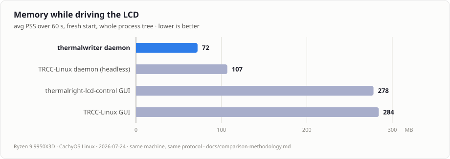
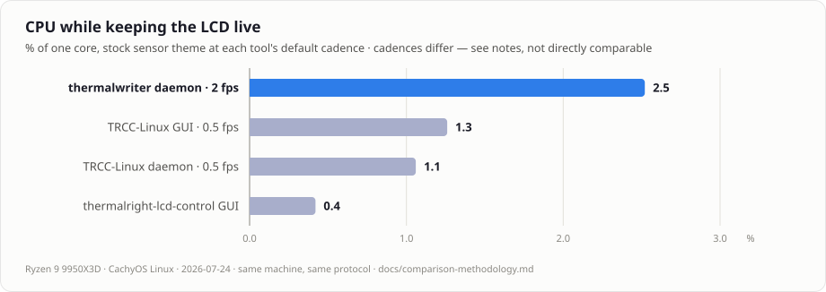
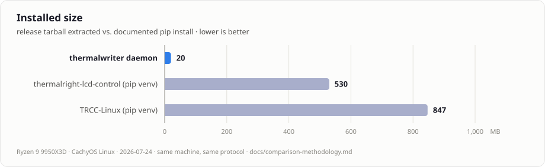
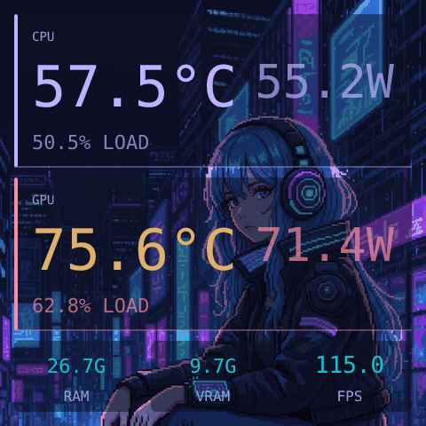
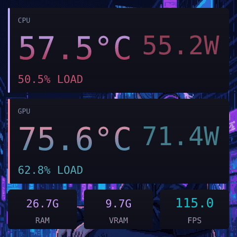
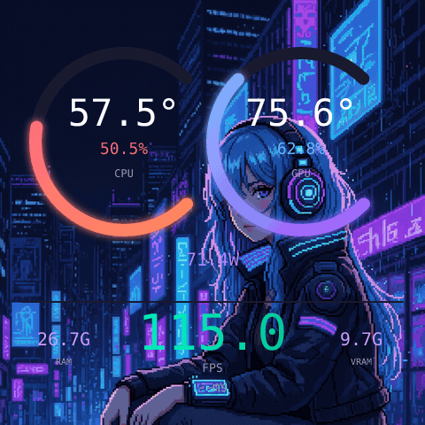
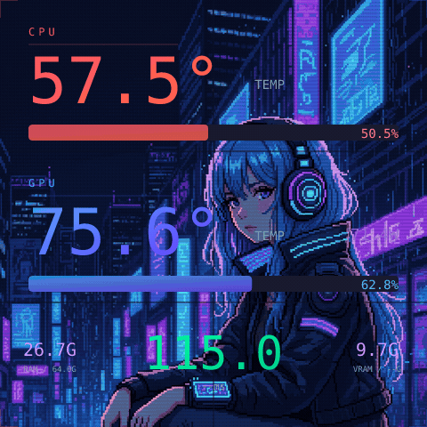

# thermalwriter

[](https://github.com/mgaruccio/thermalwriter/actions/workflows/ci.yml)
[](https://github.com/mgaruccio/thermalwriter/releases)
[](LICENSE)

`thermalwriter` is a lightweight, Linux-native daemon for Thermalright cooler LCD displays. It renders designed sensor layouts — or any X11 app — and sends JPEG frames to the cooler over USB, with the always-on footprint of a proper background daemon instead of a desktop app.

Current status: Public Beta (`v0.1.4`).

## Why thermalwriter?

A cooler screen is a background accessory — the software driving it should cost almost nothing. thermalwriter is built to sit quietly in the background of a gaming PC:

- **Lightweight, and measured**: ~81 MB PSS and **0.41% of one core** at the default 2 FPS (stock neon-dash layout, NVML GPU sensors, dirty-frame skip, 2000 ms sensor poll) — full protocol in the [comparison methodology](docs/comparison-methodology.md); frame-path microbenchmarks in [profiling baselines](docs/profiling-baselines.md).
- **A real Linux daemon**: systemd user service, D-Bus control interface, unprivileged USB access via udev, and clean SIGTERM shutdown.
- **Designed layouts**: SVG templates with live sensors, per-layout variables surfaced as GUI controls, global background images, and an optional Tauri configuration GUI.
- **Streams any X11 app**: conky, cava, btop — anything — captured from a hidden Xvfb framebuffer straight to the LCD.

If you want maximum device coverage, LED control, or video playback, [thermalright-trcc-linux](https://github.com/Lexonight1/thermalright-trcc-linux) is the feature-rich project in this space (and the upstream source of this project's protocol tables — see [License](#license)). thermalwriter deliberately trades breadth for a minimal, composable always-on footprint.

### How it compares

Measured on one machine, same day, same protocol, each tool driving the same 480×480 LCD with its stock sensor theme — full numbers, caveats, and reproduction steps in the [comparison methodology](docs/comparison-methodology.md):

<picture>
  <source media="(prefers-color-scheme: dark)" srcset="docs/assets/comparison/memory-dark.svg">
  
</picture>

<picture>
  <source media="(prefers-color-scheme: dark)" srcset="docs/assets/comparison/cpu-dark.svg">
  
</picture>

<picture>
  <source media="(prefers-color-scheme: dark)" srcset="docs/assets/comparison/install-dark.svg">
  
</picture>

## Quickstart

Download the latest release tarball from [Releases](https://github.com/mgaruccio/thermalwriter/releases), then:

```sh
tar xf thermalwriter-v*-x86_64-unknown-linux-gnu.tar.gz
cd thermalwriter-v*-x86_64-unknown-linux-gnu
./packaging/install.sh
```

Replug the cooler once so the new udev rules apply, then check:

```sh
thermalwriter ctl status
```

Source installs, the GUI, and full details below.

### Supported Devices

thermalwriter implements protocol support for the USB IDs below. Evidence is grouped at the hardware-fingerprint/profile level where one VID:PID can cover multiple panel profiles. Upstream registry evidence was last reviewed at [thermalright-trcc-linux `655a1ac`](https://github.com/Lexonight1/thermalright-trcc-linux/commit/655a1acff5c86ff0f9121f9fd4a0ea14bee35447).

**Tested** means a maintainer-reviewed full `validate-device` active pass for that exact fingerprint/profile (isolation, visual checks, soak, reconnect, daemon restore). **Likely** is upstream or local evidence without that full thermalwriter evaluation. **Untested** is code/fixture mapping without adequate physical proof. Null transport, fixtures, passive-only runs, and synthetic renders never promote Tested. See [Hardware validation](docs/hardware-validation.md) for the ordered gate workflow and safety rules.

### Tested

| Hardware fingerprint | Basis | Limitation |
| --- | --- | --- |
| `87ad:70db`, bulk, PM4/SUB5, bcdDevice 4.07 | Full guided `validate-device` pass (local) | — |

### Likely

| Hardware fingerprint | Basis | Limitation |
| --- | --- | --- |
| `0416:5302`, bcdDevice `4.07`, PM58/SUB0 (upstream unit) | [Upstream issue #228](https://github.com/Lexonight1/thermalright-trcc-linux/issues/228) / [PR #230](https://github.com/Lexonight1/thermalright-trcc-linux/pull/230): HID report transport, portrait `240×320` | Does not establish behavior for other 4.07 profiles |
| Local `0416:5302`, bcdDevice `4.07`, PM/SUB unknown | Passive `validate-device` inventory (HID IF0 IN+OUT observed, hidraw correlated, pre-handshake `hid407_read_only_probe`) | Active output, handshake, and geometry unverified; do not assume PM/SUB |
| Other upstream-reported `0416:5302` profiles (e.g. PM49, PM68/FBL192) | [Reference device registry](https://github.com/Lexonight1/thermalright-trcc-linux/blob/655a1acff5c86ff0f9121f9fd4a0ea14bee35447/doc/REFERENCE_DEVICES.md), [issue #213](https://github.com/Lexonight1/thermalright-trcc-linux/issues/213) | Firmware, PM, orientation, and transport vary under one VID:PID |
| Other `87ad:70db` profiles (PM5, PM32, PM64, …) | Same bulk family as the locally working unit; fixture-backed | Individual PM/profile combinations not evaluated locally |
| `0402:3922`, SCSI | Upstream reference-device evidence | No thermalwriter physical run |
| `0416:5406`, dual-shape (bulk preferred, SCSI fallback) | Upstream issue/report evidence | Neither thermalwriter path was physically run |
| `0416:5408`, LY bulk | Upstream physical reports | Current 1920×462 mapping is disputed by upstream 1920×480 evidence |
| `87cd:70db`, SCSI | Upstream-maintained SCSI reference evidence | Exact local fingerprint and frame output untested |

### Untested

| Hardware fingerprint | Basis | Gap |
| --- | --- | --- |
| `0418:5303`, HID Type 3 | Registry/fixture mapping | No traceable device-specific physical report found |
| `0418:5304`, HID Type 3 | Paired registry/fixture mapping | No traceable device-specific physical report found |
| `0416:5409`, LY1 | Inferred from the `5408` family | No independent physical report found |
| Fixture-only PM/FBL combinations under shared IDs | Synthetic profile coverage in null/capture tests | No matching physical fingerprint/report |

**Have one of these coolers? Testers wanted** — [open a device report](https://github.com/mgaruccio/thermalwriter/issues/new/choose) with `lsusb` output and a `thermalwriter ctl status` transcript.

## Features

<p align="center">
  
  <br/>
  <sub><b>neon-dash-v2</b> (default) — Tokyo Night accents over a custom background</sub>
</p>

<table>
  <tr>
    <td align="center"><br/><sub><b>neon-dash</b></sub></td>
    <td align="center"><br/><sub><b>arc-gauge</b></sub></td>
    <td align="center"><br/><sub><b>cyber-grid</b></sub></td>
  </tr>
  <tr>
    <td align="center" colspan="3">
      <br/>
      <sub><b>cava</b> stream preset — any X11 app via Xvfb</sub>
    </td>
  </tr>
</table>

- User-session systemd daemon with D-Bus control commands.
- Responsive SVG and legacy HTML layout renderers targeting negotiated native resolutions from portrait through ultrawide.
- Sensor providers for hwmon, sysinfo, AMDGPU, NVIDIA, MangoHud, and Intel RAPL.
- Global background image support for PNG/JPEG assets.
- Xvfb capture mode for streaming any X11 application onto the LCD, with built-in presets for conky, cava, and btop (session-only; never persisted as a boot default).
- Optional Tauri/Svelte configuration GUI under `gui/`, including a Stream tab with a live preview and one-click overlay color suggestions derived from the selected background's dominant colors.
- No hardware required for layout previews and most tests.

## Requirements

- Linux with systemd user services and udev.
- **Prebuilt x86_64 artifacts** target glibc **≥ 2.35** (built on Ubuntu 22.04). Check with `ldd --version`. Older distros should build from source.
- Rust 1.85 or newer (source builds).
- A supported Thermalright LCD cooler on USB.
- D-Bus session bus, standard on desktop Linux.
- Optional: Node.js for GUI development.
- Optional: Xvfb for mirror mode.

Source builds also need native `pkg-config`/`pkgconf` and libudev development files:

```sh
# Debian / Ubuntu
sudo apt install pkg-config libudev-dev

# Fedora
sudo dnf install pkgconf-pkg-config systemd-devel

# Arch
sudo pacman -S pkgconf systemd
```

## Install Daemon From Release Tarball

Download and extract `thermalwriter-vX.Y.Z-x86_64-unknown-linux-gnu.tar.gz`, then run:

```sh
./packaging/install.sh
```

The release installer copies the bundled `bin/thermalwriter` to `${CARGO_HOME:-~/.cargo}/bin`, writes a user systemd service whose `ExecStart` points at that exact installed binary, installs udev rules for USB display access and restricted RAPL reads, and restarts the service. If the display was already connected, replug it after install so the new USB permissions apply.

## Install Daemon From Source

Clone the repository, then run:

```sh
./packaging/install.sh
```

In a source checkout, the same installer builds with `cargo install --path . --locked` before installing the service and udev rules. If the display was already connected, replug it after install so the new USB permissions apply.

Manual install:

```sh
cargo install --path . --locked
install -Dm0644 systemd/thermalwriter.service ~/.config/systemd/user/thermalwriter.service
systemctl --user daemon-reload
thermalwriter setup-udev
systemctl --user enable --now thermalwriter
```

## Install GUI Release Artifact

The GUI companion app is available as a pre-compiled Debian package (`.deb`) or AppImage from the releases page. **Primary distribution** is tarball + `.deb` + AppImage; an [AUR package](https://github.com/mgaruccio/thermalwriter/issues/87) is recommended follow-up for Arch users, not a launch blocker.

The AppImage bundles WebKitGTK/GTK from the Tauri linuxdeploy pipeline but is **not fully standalone** — you normally need FUSE (`fuse2` / `libfuse2`). If mounting fails, use the extract-and-run fallback:

```sh
APPIMAGE_EXTRACT_AND_RUN=1 ./Thermalwriter-Config_*_amd64.AppImage
```

*Note: Installing or launching the GUI only installs/runs the GUI itself. It does **not** install the `thermalwriter` daemon, the systemd user service, or the udev rule. You must still install the daemon separately.*

### Installation / Run Commands

For Debian/Ubuntu-like systems (via `.deb`):
```sh
sudo apt install ./thermalwriter-config_*_amd64.deb
```

For general Linux distributions (via `.AppImage`):
```sh
chmod +x ./Thermalwriter*.AppImage
./Thermalwriter*.AppImage
```

If FUSE mounting fails:
```sh
APPIMAGE_EXTRACT_AND_RUN=1 ./Thermalwriter*.AppImage
```

### System tray

`thermalwriter-tray` is a tiny StatusNotifierItem helper (separate from the Tauri GUI) for opening Config, switching layouts, and starting stream presets. Left-click opens/focuses the Config GUI; right-click shows a text-only menu. The installer uses **`INSTALL_TRAY=auto`** (default): tray is installed only when a Config GUI is discoverable (`thermalwriter-gui` on PATH or a `Thermalwriter*.AppImage` in `~/Applications` / `~/Downloads`). Force or skip explicitly:

```sh
./packaging/install.sh                 # daemon; tray if GUI found
INSTALL_TRAY=1 ./packaging/install.sh  # daemon + tray (GUI-less menu OK)
INSTALL_TRAY=0 ./packaging/install.sh  # daemon only
cargo install --path tray --locked     # tray binary alone
thermalwriter-tray &
```

Point it at a non-PATH GUI binary with `THERMALWRITER_GUI=/path/to/AppImage`. See `docs/gui.md` for Hyprland/Noctalia notes.

Uninstall the service and installed binaries:

```sh
./packaging/uninstall.sh
```

The uninstall script leaves `~/.config/thermalwriter/` intact.

## Usage

```sh
systemctl --user status thermalwriter
thermalwriter ctl status
thermalwriter ctl layouts
thermalwriter ctl layout svg/neon-dash-v2.svg
thermalwriter ctl sensors
thermalwriter ctl mirror /usr/bin/conky -c ~/.config/conky/lcd.conf
```

Config lives at `~/.config/thermalwriter/config.toml`. Built-in layouts are seeded into `~/.config/thermalwriter/layouts/`, backgrounds into `~/.config/thermalwriter/backgrounds/`, and streaming wrapper configs (conky/cava) into `~/.config/thermalwriter/wrappers/`. Existing user files are not overwritten.

Streaming commands run as your user through the session daemon. Generic mirror launches use structured argv, not a shell, and `argv[0]` must be an absolute executable path; built-in presets resolve executables from the daemon's `PATH`.

For a hardware-validated playable streaming example, see [Playing Doom 3 on the LCD](docs/doom3-streaming.md). The guide covers the exact dhewm3 launch, 480×480 llvmpipe workarounds, 60 FPS mode, VNC limitations, and controller bindings.

## Preview Without Hardware

Render a layout preview PNG:

```sh
cargo run --example preview_layout layouts/svg/neon-dash-v2.svg
```

Preview the same 480×480 background/SVG compositing path used by the daemon. The
default 180° rotation matches the LCD mounting orientation:

```sh
cargo run --example preview_composite -- \
  --background assets/backgrounds/dark-gradient.png \
  --overlay examples/fixtures/calibration.svg \
  --output target/composite-preview.png \
  --inspect 240,240
```

The overlay is optional; `--rotation` accepts `0`, `90`, `180`, or `270`:

```sh
cargo run --example preview_composite -- \
  --background assets/backgrounds/dark-solid.png \
  --output target/background-only.png \
  --rotation 180
```

Render to hardware for a short mock-data run:

```sh
cargo run --example render_layout layouts/svg/neon-dash-v2.svg 15 --mock
```

Do not assume hardware is attached when developing. Prefer tests and preview examples before running hardware-facing commands.

## GUI Development

The optional GUI source code is in `gui/`:

```sh
cd gui
npm ci
npm run build
npm run tauri:dev    # devtools + MCP bridge on 127.0.0.1 (dev only)
```

Agent-driven GUI testing via the Tauri MCP bridge: [docs/agent-testing.md](docs/agent-testing.md). **Release builds do not include the MCP bridge.**

The GUI talks to the daemon over D-Bus and can also render local previews.
## RAPL Udev Rule

CPU package power comes from `/sys/class/powercap/intel-rapl:*/energy_uj`. Modern Linux kernels keep that file root-only by default after CVE-2020-8694. The included udev rule restricts matching `energy_uj` files to `root:thermalreader` with mode `0440` on powercap add/change events.

`thermalwriter setup-udev` creates the `thermalreader` group and adds the sudo-invoking user to it. Log out and back in after installation so the user-session daemon inherits the new group membership. If you skip the rule, the daemon still runs; CPU power appears unavailable and a warning points to `thermalwriter setup-udev`.

## Development

Useful checks:

```sh
cargo fmt --check
cargo test --workspace
cargo test --workspace --no-default-features
cargo clippy --workspace --all-targets -- -D warnings
cd gui && npm ci && npm run build && npm run tauri:build
```

## Documentation

For more information, consult the following documentation files:
- [CHANGELOG.md](CHANGELOG.md) - Version history and changes.
- [Hardware validation](docs/hardware-validation.md) - Guided `validate-device` workflow, evidence tiers, and safety rules for physical LCD testing.
- [Configuration Guide](docs/configuration.md) - Full details on `config.toml` structure, defaults, and ranges.
- [GUI Guide](docs/gui.md) - Detailed guide to the Svelte/Tauri-based configuration app.
- [Troubleshooting](docs/troubleshooting.md) - Common install, daemon, GUI, streaming, and compatibility issues.
- [Doom 3 Streaming Guide](docs/doom3-streaming.md) - Run the original Doom 3 through Xvfb with working gamepad controls.
- [Release Guide](docs/release.md) - Procedures for publishing and creating release packages.
- [Architecture Guide](docs/architecture.md) - Internal design of the daemon and GUI components.
- [Performance Tuning and Profiling](docs/profiling.md) - Whole-daemon profiling harness, Criterion benches, baseline workflow, and the autoresearch loop for performance work.
- [Designing Layouts](skills/designing-layouts/SKILL.md) - Guidelines for creating custom LCD layouts.

## Multi-cooler operation

`display.device = "auto"` requires exactly one supported physical display. Set
`display.device = "all"` to mirror the same layout, mode, rotation, and
background to every attached supported display (including identical `VID:PID`
units). Mirroring renders once at the primary display's oriented canvas, then
letterboxes each output to its own negotiated resolution. D-Bus `connected`,
`resolution`, and status `resolution` describe the primary display only;
`display_count` in `get_status` reports how many outputs are active.

For **independent** content on distinct coolers, configure `[[displays]]` with
one `VID:PID` entry per panel (layout/mode/rotation per entry). See
[Configuration](docs/configuration.md#displays-independent-multi-display).
D-Bus layout/mode controls still target the primary (first) entry only.

When multiple connected displays have distinct USB IDs and you want a single
display, select one with an explicit hexadecimal `VID:PID`. Two devices
sharing the same `VID:PID` cannot be targeted individually unless you use
`all` or unplug extras. For hardware-free development, set
`THERMALWRITER_TRANSPORT=null` and optionally select a negotiated fixture with
`THERMALWRITER_PROFILE=<fixture-id>`.

Mirror/`[[displays]]` membership is evaluated when the group connects. Plugging
in an additional screen while another is already active currently requires a
daemon restart. A fatal write/disconnect resets the whole group; the daemon
then reconnects the displays still present, so the surviving screen may pause
briefly.

List native resolutions and render the visual evidence matrix:

```sh
cargo run --example preview_layout -- --list
cargo run --example preview_layout -- --matrix \
  --output-dir target/multi-cooler-visual-qa
```

Layouts opt into native reflow with `{# canvas: responsive #}`. A declared fixed
canvas (`{# canvas: WIDTHxHEIGHT #}`), and unannotated legacy 480×480 layouts,
are uniformly contained and centered without distortion. Background images use
centered cover at the negotiated device resolution.

## License

GPL-3.0-or-later. See `LICENSE`.

Protocol tables and multi-cooler wire behavior are derived from
[thermalright-trcc-linux](https://github.com/Lexonight1/thermalright-trcc-linux)
at commit `390b880abd4cf0ed2d6eae7151493432263eff39` (project version 9.8.6,
four commits after the `v9.8.6` tag), which is also licensed under
GPL-3.0-or-later.
