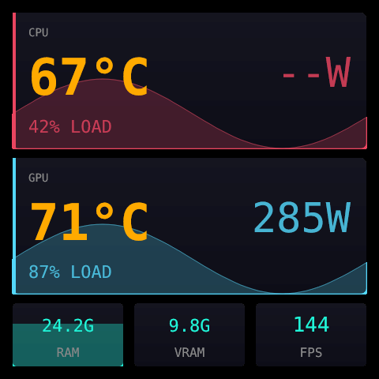

# thermalwriter

`thermalwriter` is a lightweight Linux daemon for Thermalright cooler LCD displays. It replaces the large vendor Python/Qt app with a Rust service that renders local layouts, polls system sensors, and sends JPEG frames over USB.

Current status: Public Beta (`v0.1.0`).

### Supported Devices

| Status | USB ID | Transport / notes |
| --- | --- | --- |
| **Hardware-smoked** | `87ad:70db` | Raw bulk Grand Vision family; negotiated PM/FBL selects native geometry and JPEG/RGB565 |
| **Fixture-verified** | `87cd:70db`, `0402:3922` | SCSI LCD over `scsi_generic` |
| **Fixture-verified** | `0416:5302` | HID LCD Type 2 |
| **Fixture-verified** | `0418:5303`, `0418:5304` | HID LCD Type 3 |
| **Fixture-verified** | `0416:5408`, `0416:5409` | LY bulk / Trofeo Vision family |
| **Fixture-verified** | `0416:5406` | Dual-shape Winbond device: vendor bulk preferred, SCSI fallback |
| **Not supported** | Other IDs / non-Linux hosts | Unknown devices are rejected rather than guessed |

## Features



- User-session systemd daemon with D-Bus control commands.
- Responsive SVG and legacy HTML layout renderers targeting negotiated native resolutions from portrait through ultrawide.
- Sensor providers for hwmon, sysinfo, AMDGPU, NVIDIA, MangoHud, and Intel RAPL.
- Global background image support for PNG/JPEG assets.
- Xvfb capture mode for streaming any X11 application onto the LCD, with built-in presets for conky, cava, and btop (session-only; never persisted as a boot default).
- Optional Tauri/Svelte configuration GUI under `gui/`, including a Stream tab with a live preview and one-click overlay color suggestions derived from the selected background's dominant colors.
- No hardware required for layout previews and most tests.

## Requirements

- Linux with systemd user services and udev.
- Rust 1.85 or newer.
- A supported Thermalright LCD cooler on USB.
- D-Bus session bus, standard on desktop Linux.
- Optional: Node.js for GUI development.
- Optional: Xvfb for mirror mode.

Source builds also need native `pkg-config`/`pkgconf` and libudev development files:

```sh
# Debian / Ubuntu
sudo apt install pkg-config libudev-dev

# Fedora
sudo dnf install pkgconf-pkg-config systemd-devel

# Arch
sudo pacman -S pkgconf systemd
```

## Install Daemon From Release Tarball

Download and extract `thermalwriter-vX.Y.Z-x86_64-unknown-linux-gnu.tar.gz`, then run:

```sh
./packaging/install.sh
```

The release installer copies the bundled `bin/thermalwriter` to `${CARGO_HOME:-~/.cargo}/bin`, writes a user systemd service whose `ExecStart` points at that exact installed binary, installs udev rules for USB display access and restricted RAPL reads, and restarts the service. If the display was already connected, replug it after install so the new USB permissions apply.

## Install Daemon From Source

Clone the repository, then run:

```sh
./packaging/install.sh
```

In a source checkout, the same installer builds with `cargo install --path . --locked` before installing the service and udev rules. If the display was already connected, replug it after install so the new USB permissions apply.

Manual install:

```sh
cargo install --path . --locked
install -Dm0644 systemd/thermalwriter.service ~/.config/systemd/user/thermalwriter.service
systemctl --user daemon-reload
thermalwriter setup-udev
systemctl --user enable --now thermalwriter
```

## Install GUI Release Artifact

The GUI companion app is available as a pre-compiled Debian package (`.deb`) or standalone executable (`.AppImage`) from the releases page.

*Note: Installing or launching the GUI only installs/runs the GUI itself. It does **not** install the `thermalwriter` daemon, the systemd user service, or the udev rule. You must still install the daemon separately.*

### Installation / Run Commands

For Debian/Ubuntu-like systems (via `.deb`):
```sh
sudo apt install ./thermalwriter-config_*_amd64.deb
```

For general Linux distributions (via `.AppImage`):
```sh
chmod +x ./Thermalwriter*.AppImage
./Thermalwriter*.AppImage
```

Uninstall the service and installed binary:

```sh
./packaging/uninstall.sh
```

The uninstall script leaves `~/.config/thermalwriter/` intact.

## Usage

```sh
systemctl --user status thermalwriter
thermalwriter ctl status
thermalwriter ctl layouts
thermalwriter ctl layout svg/neon-dash-v2.svg
thermalwriter ctl sensors
thermalwriter ctl mirror /usr/bin/conky -c ~/.config/conky/lcd.conf
```

Config lives at `~/.config/thermalwriter/config.toml`. Built-in layouts are seeded into `~/.config/thermalwriter/layouts/`, backgrounds into `~/.config/thermalwriter/backgrounds/`, and streaming wrapper configs (conky/cava) into `~/.config/thermalwriter/wrappers/`. Existing user files are not overwritten.

Streaming commands run as your user through the session daemon. Generic mirror launches use structured argv, not a shell, and `argv[0]` must be an absolute executable path; built-in presets resolve executables from the daemon's `PATH`.

## Preview Without Hardware

Render a layout preview PNG:

```sh
cargo run --example preview_layout layouts/svg/neon-dash-v2.svg
```

Preview the same 480×480 background/SVG compositing path used by the daemon. The
default 180° rotation matches the LCD mounting orientation:

```sh
cargo run --example preview_composite -- \
  --background assets/backgrounds/dark-gradient.png \
  --overlay examples/fixtures/calibration.svg \
  --output target/composite-preview.png \
  --inspect 240,240
```

The overlay is optional; `--rotation` accepts `0`, `90`, `180`, or `270`:

```sh
cargo run --example preview_composite -- \
  --background assets/backgrounds/dark-solid.png \
  --output target/background-only.png \
  --rotation 180
```

Render to hardware for a short mock-data run:

```sh
cargo run --example render_layout layouts/svg/neon-dash-v2.svg 15 --mock
```

Do not assume hardware is attached when developing. Prefer tests and preview examples before running hardware-facing commands.

## GUI Development

The optional GUI source code is in `gui/`:

```sh
cd gui
npm ci
npm run build
npm run tauri:dev
```

The GUI talks to the daemon over D-Bus and can also render local previews.
## RAPL Udev Rule

CPU package power comes from `/sys/class/powercap/intel-rapl:*/energy_uj`. Modern Linux kernels keep that file root-only by default after CVE-2020-8694. The included udev rule restricts matching `energy_uj` files to `root:thermalreader` with mode `0440` on powercap add/change events.

`thermalwriter setup-udev` creates the `thermalreader` group and adds the sudo-invoking user to it. Log out and back in after installation so the user-session daemon inherits the new group membership. If you skip the rule, the daemon still runs; CPU power appears unavailable and a warning points to `thermalwriter setup-udev`.

## Development

Useful checks:

```sh
cargo fmt --check
cargo test --workspace
cargo test --workspace --no-default-features
cargo clippy --workspace --all-targets -- -D warnings
cd gui && npm ci && npm run build && npm run tauri:build
```

## Documentation

For more information, consult the following documentation files:
- [CHANGELOG.md](CHANGELOG.md) - Version history and changes.
- [Configuration Guide](docs/configuration.md) - Full details on `config.toml` structure, defaults, and ranges.
- [GUI Guide](docs/gui.md) - Detailed guide to the Svelte/Tauri-based configuration app.
- [Release Guide](docs/release.md) - Procedures for publishing and creating release packages.
- [Architecture Guide](docs/architecture.md) - Internal design of the daemon and GUI components.
- [Performance Tuning and Profiling](docs/profiling.md) - Whole-daemon profiling harness, Criterion benches, baseline workflow, and the autoresearch loop for performance work.
- [Designing Layouts](skills/designing-layouts/SKILL.md) - Guidelines for creating custom LCD layouts.

## Multi-cooler operation

`display.device = "auto"` requires exactly one supported physical display. When
multiple connected displays have distinct USB IDs, select one with an explicit
hexadecimal `VID:PID`. Displays sharing the same `VID:PID` cannot currently be
disambiguated; unplug extras. For hardware-free development, set
`THERMALWRITER_TRANSPORT=null` and optionally select a negotiated fixture with
`THERMALWRITER_PROFILE=<fixture-id>`.

List native resolutions and render the visual evidence matrix:

```sh
cargo run --example preview_layout -- --list
cargo run --example preview_layout -- --matrix \
  --output-dir target/multi-cooler-visual-qa
```

Layouts opt into native reflow with `{# canvas: responsive #}`. A declared fixed
canvas (`{# canvas: WIDTHxHEIGHT #}`), and unannotated legacy 480×480 layouts,
are uniformly contained and centered without distortion. Background images use
centered cover at the negotiated device resolution.

## License

GPL-3.0-or-later. See `LICENSE`.

Protocol tables and multi-cooler wire behavior are derived from
[thermalright-trcc-linux](https://github.com/Lexonight1/thermalright-trcc-linux)
at commit `390b880abd4cf0ed2d6eae7151493432263eff39` (project version 9.8.6,
four commits after the `v9.8.6` tag), which is also licensed under
GPL-3.0-or-later.
