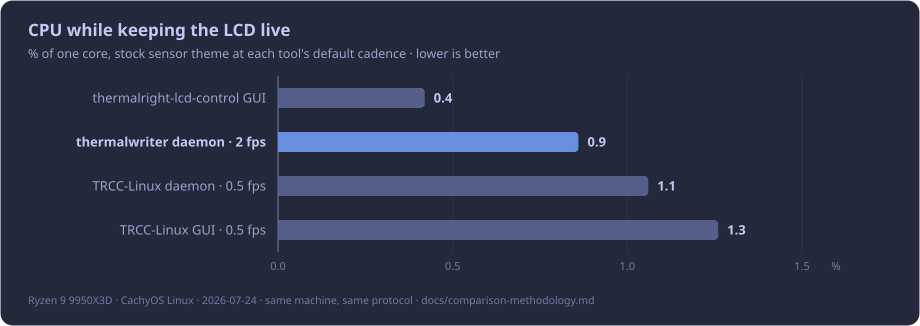

# Comparison methodology

Measured comparison of thermalwriter against the two other actively maintained
Linux tools that drive the same Thermalright LCD hardware. Everything here was
measured on one machine, on one day, with the same sampler and protocol for
every tool — no numbers are quoted from other projects' docs or from the
Windows vendor app. Both alternatives are good projects with different goals
(device breadth, LED control, video themes, GUI-first workflows);
[TRCC-Linux](https://github.com/Lexonight1/thermalright-trcc-linux) in
particular is the upstream source of thermalwriter's protocol tables. This
document compares always-on footprint only, because that is thermalwriter's
design goal.

## Contenders

| Tool | Version measured | Source | Language / stack |
|---|---|---|---|
| thermalwriter | v0.1.0 | release-profile build of the v0.1.0 tag (`cargo install`) | Rust |
| [thermalright-trcc-linux](https://github.com/Lexonight1/thermalright-trcc-linux) ("TRCC-Linux") | 9.9.2 | `pip install trcc-linux` (PyPI) | Python / PySide6 |
| [thermalright-lcd-control](https://github.com/rejeb/thermalright-lcd-control) | 2.0.0 | `pip install .` at commit `3196e4c` | Python / PySide6-Essentials + OpenCV + pyvips |

TRCC-Linux was measured in **two** modes: its opt-in headless daemon
(`trcc daemon`, the same shape as thermalwriter's service — this is the
fairest apples-to-apples row) and its GUI (`trcc gui`, the primary interface
its README documents). thermalright-lcd-control is a GUI application with the
device controller embedded in it; there is no headless mode to measure.

## Machine & environment

- AMD Ryzen 9 9950X3D · 60 GiB RAM · NVIDIA RTX 5080 (nvidia sensor polling
  active for tools that support it)
- CachyOS Linux, kernel 7.1.3-2-cachyos
- Swap: 60 GiB zram, `vm.swappiness=150`. This is aggressive: the kernel
  compresses idle anonymous pages within minutes. It affects every tool
  equally under this protocol (fresh start, identical timing), but it is why
  long-uptime RSS on this machine reads lower than a fresh process — see the
  uptime note below.
- Python 3.14.6 for both Python tools, each in its own fresh venv
- Device: Thermalright Peerless Vision (reports as "GrandVision 360 AIO",
  USB `87ad:70db`), 480×480 JPEG over vendor bulk protocol — every run below
  drove the real device
- Date: 2026-07-24

## Workloads

Each tool rendered its own stock sensor-dashboard theme — the out-of-box
experience, not a hand-tuned equalized scene:

- **thermalwriter**: default `svg/neon-dash-v2` layout (CPU/GPU temp + load,
  animated history graphs, several labeled readouts) over a global background
  image, 2 fps default tick rate, JPEG quality 85
- **TRCC-Linux** (both modes): stock `Theme1` for 480×480 (background art,
  mask, CPU/GPU temperature text overlays), default 2 s refresh interval
- **thermalright-lcd-control**: stock `theme_1` preset for 480×480
  (background + foreground art, date and sensor text overlays), default config

These are *not* pixel-identical workloads, and the tools do different work
per tick by design — see "Reading the CPU numbers" before quoting those.

## Protocol

Every tool runs inside its own systemd user unit (thermalwriter's real
service; `systemd-run --user` transient units for the others), so the kernel's
cgroup accounting captures the whole process tree, including short-lived
children such as forked sensor utilities.

Per configuration:

1. Stop every other tool; the device is exclusive to the tool under test.
2. Start the unit fresh (no reuse of a warm process).
3. Load/confirm the workload above and verify frames are reaching the device
   (each tool's own logs).
4. Wait 60 s (warmup), then measure for 60 s with
   [`scripts/footprint_sampler.sh`](../scripts/footprint_sampler.sh):
   - **CPU**: delta of the cgroup's `cpu.stat usage_usec` across the window —
     kernel accounting, includes exited children.
   - **Memory**: every 0.5 s, sum `Rss:` and `Pss:` from
     `/proc/<pid>/smaps_rollup` across every PID in the cgroup. **PSS is the
     headline number**: shared pages are divided among the processes mapping
     them instead of double-counted, which is the fair treatment for
     multi-process Qt/Python tools.

The exact sweep driver (unit definitions, theme-load commands, ordering) is
reproduced at the bottom.

## Results

### Steady-state footprint (each tool at its defaults)

| Configuration | CPU (% of one core) | avg RSS (MB) | peak RSS (MB) | avg PSS (MB) | peak PSS (MB) |
|---|---|---|---|---|---|
| thermalwriter daemon · 2 fps | **0.74** | 71.6 | 71.6 | 68.9 | 68.9 |
| TRCC-Linux daemon (headless) · 0.5 fps | 1.06 | 118.8 | 118.9 | 106.9 | 107.5 |
| TRCC-Linux GUI · 0.5 fps | 1.26 | 301.4 | 301.4 | 284.2 | 284.2 |
| thermalright-lcd-control GUI | 0.42 | 295.9 | 298.5 | 278.0 | 281.5 |

thermalwriter remeasure after #91 (dirty-frame skip + NVML + skip spd5118
DIMM sensors). Binary SHA-256
`a16b100257a2166321a9406a53e1469dbf3426590a037bfa68a6f7ef6c444702`, sampled
via `scripts/footprint_sampler.sh thermalwriter.service 60 60` against the
user unit `ExecStart=%h/.cargo/bin/thermalwriter daemon` immediately after
`cp target/release/thermalwriter ~/.cargo/bin/ && systemctl --user restart`.
Memory is higher than the first 2026-07-24 snapshot (41.7 MB PSS) because
this path loads NVML and settles with the full sensor + background stack; it
is still well below the Python daemons.

### Matched update cadence (1 s), where supported

thermalwriter's tick rate and TRCC-Linux's refresh interval can both be set
to 1 s (thermalright-lcd-control's cadence is fixed by its theme). The
thermalwriter 1 fps row below is the pre-#91 figure; after dirty-frame skip +
NVML the default 2 fps path already undercuts TRCC's default, so the matched
cadence row was not re-swept:

| Configuration | CPU (% of one core) | avg PSS (MB) |
|---|---|---|
| thermalwriter daemon · 1 fps (pre-#91) | 2.40 | 41.2 |
| TRCC-Linux daemon · 1 s refresh | 0.68 | 105.9 |

### Installed size

| Tool | On disk | Install method measured |
|---|---|---|
| thermalwriter daemon | **20.2 MB** (6.5 MB download) | v0.1.0 release tarball, extracted |
| TRCC-Linux | 847 MB | `pip install trcc-linux` in a fresh venv (PySide6 wheel alone is 648 MB) |
| thermalright-lcd-control | 530 MB | `pip install .[nvidia]` in a fresh venv (PySide6-Essentials 232 MB + OpenCV 188 MB) |

Caveats, in fairness to the Python tools: ~13 MB of each venv is pip itself;
distro-native packages can share the Qt/Python runtime with other installed
applications (the runtime dependency exists either way — measured here via
the vendor-documented cross-distro pip path). thermalwriter's *optional*
config GUI is a separate 82 MB AppImage / 8.4 MB deb and is not required to
run the daemon; the Python tools bundle their GUIs in the single install.

## Reading the CPU numbers

**Do not read the CPU column as a pure per-frame efficiency ranking.** The
tools still do different work per tick, but the gap is much smaller after
[#91](https://github.com/mgaruccio/thermalwriter/issues/91):

- thermalwriter fingerprints the resolved template inputs (sensor strings,
  history series, layout vars, theme, background) each tick and **skips
  render/encode/send** when nothing displayed changed. The stock layout's
  history graphs still force a real redraw at the sensor poll rate (1 Hz
  default). GPU metrics come from **NVML** (in-process); `nvidia-smi` is only
  a fallback when NVML is unavailable.
- TRCC-Linux polls sensors every tick but skips the render on a cache hit
  when nothing displayed changed (its stock theme shows integer °C readouts,
  which change rarely).
- thermalright-lcd-control pre-encodes frames and re-encodes only when a
  displayed value changes; most ticks send a cached frame.

The honest headline is that **every tool here is cheap on CPU — all under
~1.3% of one core at their defaults**, and thermalwriter is now the lightest
headless daemon on CPU while staying the lightest on memory and install size
by a wide margin.



## Memory notes

- The protocol measures a *fresh* process (60 s warmup). On this
  swap-aggressive machine, long uptimes read much lower: after 2 days
  running, the thermalwriter daemon's VmRSS sat at **7.2 MB** (with ~9.7 MB
  compressed into zram, VmHWM 24.9 MB). That figure is an observation from a
  single long-running instance, not part of the controlled protocol — quote
  the **68.9 MB PSS** number from the table above, not the long-uptime
  observation, unless the uptime context is stated.
- thermalwriter's peak in the first measured seconds is startup cost: the
  system font scan, NVML load, and decoding the 960×960 background image; it
  settles within the warmup window.
- These absolute numbers are machine-specific (sensor population, GPU,
  kernel, swap policy). The *relative* picture is the durable part.

## Reproducing

```bash
# thermalwriter side (service already installed):
systemctl --user restart thermalwriter.service
scripts/footprint_sampler.sh thermalwriter.service 60 60

# TRCC-Linux headless daemon:
python3 -m venv venv-trcc && venv-trcc/bin/pip install trcc-linux
systemd-run --user --unit=footprint-trcc --setenv=QT_QPA_PLATFORM=offscreen \
  "$PWD/venv-trcc/bin/trcc" daemon
TRCC_DAEMON=1 venv-trcc/bin/trcc display load-theme 87ad:70db \
  ~/.trcc/data/theme480480/Theme1        # stock theme, seeded on first run
scripts/footprint_sampler.sh footprint-trcc.service 60 60
systemctl --user stop footprint-trcc.service

# TRCC-Linux GUI:  systemd-run --user --unit=footprint-trcc-gui "$PWD/venv-trcc/bin/trcc" gui
# thermalright-lcd-control: pip install from a clone, then run
#   thermalright-lcd-control-app with gui_config.yaml in the working directory
#   (the pip entry point ignores --config), and sample its unit the same way.

# Charts (docs/assets/comparison/*.svg) regenerate from the numbers above:
python3 scripts/make_comparison_charts.py
```

Chart colors were validated with the palette validator from the design
method used for these graphs (CVD separation accent↔gray ΔE 28.1 dark /
45.8 light; the de-emphasis gray's sub-3:1 surface contrast is permitted
because every bar carries a direct value label and this document is the
table view).
